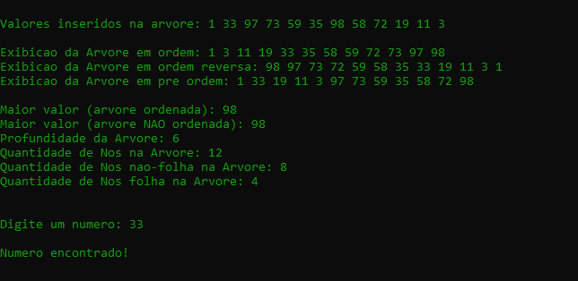

<h1>Árvore Binária de Busca (ABB) – Estrutura de Dados em C</h1>

## Tópicos

- [Sobre o Projeto](#sobre-o-projeto)  
- [Estrutura do Projeto](#estrutura-do-projeto)  
- [Funcionalidades](#funcionalidades)  
- [Tecnologias](#tecnologias)  
- [Como executar o projeto](#como-executar-o-projeto)

# Sobre o Projeto
Este projeto implementa uma Árvore Binária de Busca (ABB) em linguagem C, com o objetivo de demonstrar os conceitos de estrutura de dados e modularização de código em um projeto organizado com separação entre arquivos de cabeçalho (`.h`) e implementação (`.c`).

# Estrutura do Projeto
## `include/`
 ###   `no.h`
- Define a estrutura do nó da árvore (`t_no`), contendo o valor (`info`) e ponteiros para os filhos esquerdo e direito.
- Protótipos das funções para criar e mostrar um nó.

### `abb.h`
- Define a estrutura da ABB (`t_abb`), que contém o ponteiro para a raiz da árvore.
- Protótipos das funções para inicializar a árvore, inserir elementos, exibir elementos (em ordem, pré-ordem, ordem reversa), buscar valores e obter propriedades da árvore (maior valor, profundidade, contagem de nós).

## `src/`
### `no.c`
- Implementa as funções para criar um novo nó (`constroi_no`) e para imprimir o valor do nó (`mostrar_no`).

### `abb.c`
- Implementação completa das funções da árvore binária de busca (ABB).

### `main.c`
- Programa principal que testa e demonstra o funcionamento da Árvore Binária de Busca (ABB) implementada.


# Funcionalidades

### `insere`
```c
void insere(int i, t_abb *a);
```
- Adiciona elementos mantendo a ordem da ABB (menores/iguais à esquerda, maiores à direita)

### `exibe_in_order`
```c
void exibe_in_order(t_abb *a);
```
- Mostra os valores ordenados do menor para o maior (em ordem)

### `exibe_rev_order`
```c
void exibe_rev_order(t_abb *a);
```
- Mostra os valores ordenados do maior para o menor (ordem reversa)

### `exibe_pre_order`
```c
void exibe_pre_order(t_abb *a);
```
- Exibe a raiz antes das subárvores (pré-ordem)

### `exibe_maior`
```c
int exibe_maior(t_abb *a);
```
- Retorna o elemento mais à direita (maior valor na ABB ordenada)

### `exibe_maior_arvore_nao_ordenada`
```c
int exibe_maior_arvore_nao_ordenada(t_abb *a);
```
- Percorre todos os nós para encontrar o maior valor (funciona em qualquer árvore binária)

### `exibe_profundidade`
```c
int exibe_profundidade(t_abb *a);
```
- Retorna o número de níveis da árvore (distância da raiz até a folha mais distante)

### `exibe_qtd_nos`
```c
int exibe_qtd_nos(t_abb *a);
```
- Calcula o total de nós na árvore

### `exibe_qtd_nos_nao_folha`
```c
int exibe_qtd_nos_nao_folha(t_abb *a);
```
- Conta apenas os nós que possuem pelo menos um filho

### `exibe_qtd_nos_folha`
```c
int exibe_qtd_nos_folha(t_abb *a);
```
- Conta apenas os nós sem filhos (folhas)

### `busca_numero_arvore_nao_ordenada`
```c
int busca_numero_arvore_nao_ordenada(t_abb *a, int valor);
```
- Procura um valor específico percorrendo toda a árvore (retorna o valor se encontrado, senão -1)

# Tecnologias
<table align="center">
    <tr>
        <th>
            Linguagem
        </th>
        <td>
            
        </td>
    </tr>
    <tr>
        <th>
            Editor
        </th>
        <td>
            
        </td>
    </tr>
</table>

# Como executar o projeto

1. Clone este repositório:
```bash
git clone https://github.com/pedro-Trovo/abb-arvore-binaria-de-busca
```
2. Acesse a pasta do projeto:
```bash
cd abb-arvore-binaria-busca
```
3. Compile o projeto com gcc:
```bash
gcc src/main.c src/abb.c src/no.c -Iinclude -o abb
```
4. Execute o programa :
```bash
abb.exe
```
<br><br>

# Imagens do Projeto
## Caso de teste completo - ABB
